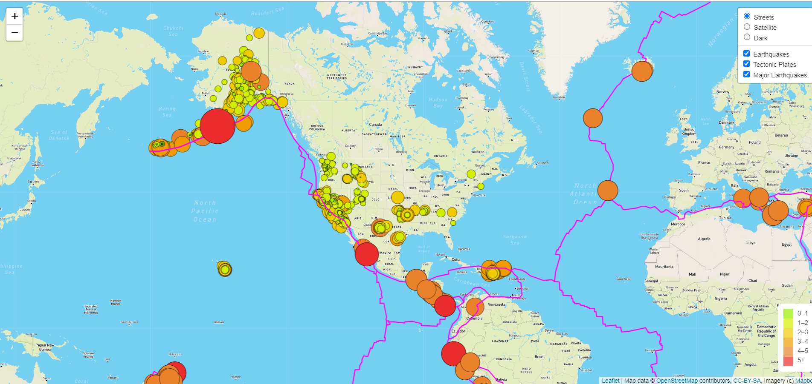
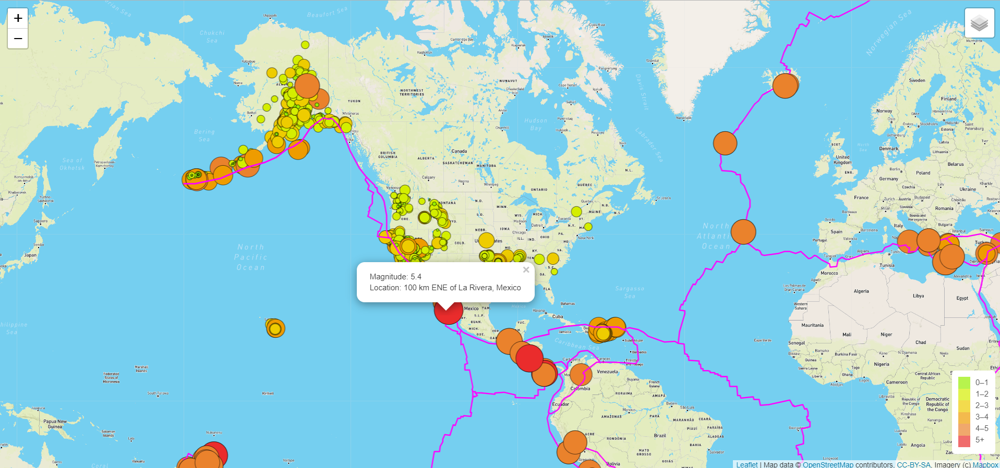

# Mapping_Earthquakes
Creating interactive earthquake maps using GeoJson and show the differences between the magnitudes of earthquakes all over the world for the last seven days.

## Purpose and Overview of the project
1. In this project we have used D3library, Leaflet library and JavaScript , to retrieve GeoJson earthquake data and tectonic plate data in order to populate a geographical map. 
   We have retrieved this data from the U.S. Geological Survey website.
   
2. Leaflet API is used to build web map applications and here we have populated a geographical map with GeoJSON earthquake data from a URL.
   
3. GeoJson data is a type of JSON data that is specifically designed to host geographical information. It consists of geographical features like points that contain addresses and 
   specific locations, linestrings which contain coordinates for the boundaries of travel routes and tectonic plates etc and polygons which contain coordinates for the boundaries of
   counties,countries and tracts of land.
   
4. On the map the magnitude and location of each earthquake is shown with a popup marker. The diameters and colours  of the marker represent the magnitude and intensity of the earthquake.

5. There are three layer groups added to our map. The first layer represents all the earthquakes that took place around the world in past seven days, the second layer is the tectonic
   plates data that is shown by a line on the map as it contains the linestring object and the third layer is the major earthquakes with magnitude greater than 4.5.
   
6. On opening the page we can see all the three layers on the map and can choose one of the map styles that is street view , satellite view or dark view. On each circle marker
   we can see a popup showing the location and magnitude of the earthquake.

	

	
